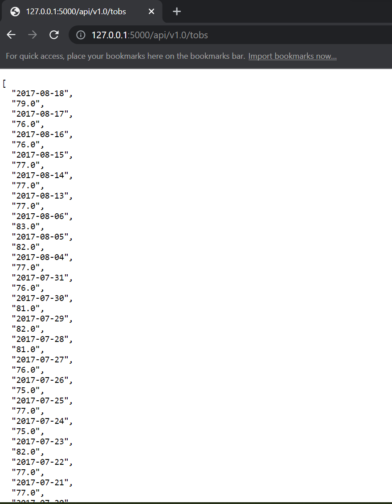

# SQLAlchemy-challenge
Surfs Up!  Climate analysis!

I've decided to treat myself to a long holiday vacation in Honolulu, Hawaii! To help with the trip planning, I need to do some climate analysis on the area. 

Python and SQLAlchemy are used to do climate analysis and data exploration of the climate database including SQLAlchemy ORM queries, Pandas, and Matplotlib.

The climate analysis can be found at [starter notebook](/main/climate_starter.ipynb). This includes the precipiation analysis and the station analysis.

A Flask API was designed based on the queries developed. [app/py](./app.py)

To run the app.py, nevigate to the folder and type "python app.py".
Open the homepage and adjust the url to your selection from the list of routes:

The following code contains additional queries: 

/api/v1.0/precipitation

/api/v1.0/stations

/api/v1.0/tobs

/api/v1.0/start_date/2011-05-01

/api/v1.0/start/end/2016-01-01/31-07-2017

This climate analysis code can be found at [starter notebook](./climate_starter.ipynb). This includes the precipiation analysis and the station analysis.

The following are optional challenge queries: 
[bonus 1](./temp_analysis_bonus_1_starter.ipynb) and [bonus 2](./temp_analysis_bonus_2_starter.ipynb)
